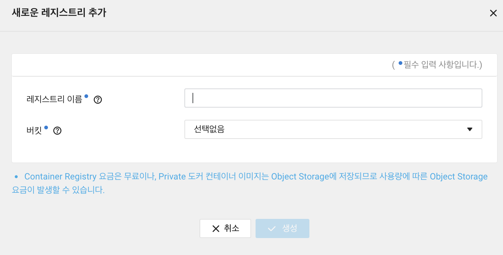

최근에 업무가 많아지다보니.. 블로깅이 안되고 있었는데.. (나태한 놈)

이번에  Java + Spring 에서 Kotlin + Spring으로 변경하면서 서버도 다시 새로 파게 되었습니다.

그러다 보니 이번 초에 만들었던 Web버전 MSA를 지우고 새로 구축을 하기로 했습니다..

# 현재의 구축방식..

지금 배포방식이 Jenkins로 빌드 테스트 후 Publish SSH Over을 이용해서 빌드한 Jar 파일을 원격서버에 들고와서 Docker로 처리하는 방법을 사용하고 있는데 

이렇게 된다면 image에 올리는 순간 Jar파일은 무쓸모한 메모리 차지하는 trash가 될 것이고 삭제하면 되지만 애초에 Docker를 사용하는데 Jar파일을 왜 불러올까 라는 생각을 하게되었습니다.

또 Jar파일로 빌드하게 되면 이전에 사용했던 image는 <none>으로 바뀌면서 메모리가 누적되는 이슈도 발생했습니다. (그래서 삭제하는 코드도 넣었어야하능..)

이것을 좀 해결을 해야할 부분이여서 Docker Registry를 이용해서 한번 배포하는게 좋지 않을까 라는 생각을 해서 한번 바로 시도를 했습니다.

그래서 저가 Registry에 올리면서 경험했던 부분을 공유하려 합니다

# 클라우드 만들기

정말 AWS를 사용해서 하고싶지만 저희의 Cloud 플랫폼은 Ncloud라서 Ncloud의 서비스를 이용하게 되었습니다. 

Ncloud에서 Container Registry가 있더라구여 그래서 바로 사용해보았습니다.

처음 만들면 버킷이란 것이 있는데 알고보니 Storage를 설정하는거였습니다 마치 AWS S3처럼요



Container만 생성한다면 Docker Registry image를 관리할 수 있는데.. 저장소가 필요할 줄은 몰랐네요

아무튼 생성을 다하면 registry가 생성이됩니다. 

# Jenkins 설정

이제 Spring을 빌드하면 Container Registry에 저장되고 배포할땐 내려받아서 실행시키는 부분을 Jenkins에서 설정해줄겁니다.

## jenkinsfile

```bash
pipeline {
    agent any 	// 사용 가능한 에이전트에서 이 파이프라인 또는 해당 단계를 실행
     environment {
}
    }
    
    stages {
        stage('Prepare') {
            steps {
                script{
                    // Git repository with credentials
                    withCredentials([usernamePassword(credentialsId: 'chan', usernameVariable: 'USERNAME', passwordVariable: 'PASSWORD')]) {
                        git url: 'https://chan@bitbucket.org/chan/kotlin_springboot_template.git', branch: 'kcl_template', credentialsId: 'chan', 
                        username: "${USERNAME}", password: "${PASSWORD}"
                    }
                }
            }
            
            post {
                success { 
                    sh 'echo "Successfully Cloned Repository"'
                }
                failure {
                    sh 'echo "Fail Cloned Repository"'
                }
            }    
        }
        
        stage('Build') {
            steps {
                sh 'chmod +x gradlew'
                sh './gradlew --warning-mode=all --stacktrace clean build'
                sh 'ls -al ./build/libs'
            }
            post {
                success {
                    echo 'Gradle build success'
                    archiveArtifacts artifacts: 'build/libs/*.jar', fingerprint: true
                }
                failure {
                    echo 'Gradle build failed'
                }
            }
        }
        

        stage('Push Docker Image') {
            steps {
                script {
                    sh "./gradlew jib"
                }
            }
        }

        
        stage('Deploy') {
          steps {
            script {
              def sshServer = [serverName: 'chan-msa']
              sshPublisher(publishers: [
                sshPublisherDesc(configName: sshServer.serverName, transfers: [
                    sshTransfer(execCommand: 'bash /home/deploy.sh test', sourceFiles: '', removePrefix: '', remoteDirectory: '/home', excludes: '', flatten: false),
                ])
              ])
            }
          }
        }
    }
}
```

해당 방법은 item을 생성해서 pipline을 만드셔서 jenkinsfile을 Pipeline script에 작성하시면 됩니다.

한 단계식 설명을 드리겠습니다.

### Prepare

```bash
stage('Prepare') {
            steps {
                script{
                    // Git repository with credentials
                    withCredentials([usernamePassword(credentialsId: 'chan', usernameVariable: 'USERNAME', passwordVariable: 'PASSWORD')]) {
                        git url: 'https://chan@bitbucket.org/chan/kotlin_springboot_template.git', branch: 'kcl_template', credentialsId: 'chan', 
                        username: "${USERNAME}", password: "${PASSWORD}"
                    }
                }
            }
            
            post {
                success { 
                    sh 'echo "Successfully Cloned Repository"'
                }
                failure {
                    sh 'echo "Fail Cloned Repository"'
                }
            }    
        }
```

해당 부분은 Git에서 코드를 불러오는 단계며 Jenkins에있는 자격증명을 들고와서 불러오는 코드입니다.

### Build

```bash
stage('Build') {
            steps {
                sh 'chmod +x gradlew'
                sh './gradlew --warning-mode=all --stacktrace clean build'
                sh 'ls -al ./build/libs'
            }
            post {
                success {
                    echo 'Gradle build success'
                    archiveArtifacts artifacts: 'build/libs/*.jar', fingerprint: true
                }
                failure {
                    echo 'Gradle build failed'
                }
            }
        }
```

해당 구간은 빌드 테스트하고 실행 가능한 지 확인합니다. 지금까지는 Jenkins 를 이용했던 사람이라면 큰 어려움이 없을 것 같습니다.

### Docker Push

```bash
stage('Push Docker Image') {
		steps {
				script {
	         sh "./gradlew jib"
        }
    }
}
```

처음보는 명령어가 있을 건데 jib는 gradle에 google에서 제공하는 registry에 접속을 도와주는 plugin입니다

```bash
plugins{
	id("com.google.cloud.tools.jib") version "3.1.4"
}

jib {
    from {
        image = "openjdk:11"
    }
    to {
        image = "dev-chan-registry.kr.ncr.ntruss.com/stage/test"
    }
    container {
        jvmFlags = listOf("-Xms512m", "-Xmx1024m")
    }
}
```

처음에는 Docker 서버를 Jenkins에서 Docker Push를 진행할려 했지만 

Docker안에 있는 가상 컨테이너 Jenkins는 다른 공간이라서 Docker 접근이 불가능 합니다.

그래서 Jenkins 실행할때 volume을 추가해서 Docker 를 사용할 수 있게 하려 했지만 이미 실행 되어있는 jenkins에 붙히기에는 많이 까다롭더라구요

다른 방법을 사용할 수 있을까 찾아보다가 jib라는 기술을 사용하게 되었습니다.

플러그인을 설정하고 jib에 내가 docker push할 정보들을 담으면 됩니다.

from에는 내가 필요한 jdk, image를 들고오면 됩니다.

to는 docker push할 데이터를 등록

container에는 내가 image에 등록할 설정을 넣으면 될것같습니다.

또 jib 플러그인을 사용하게되면 gradle이 jib에 의존성을 갖게 됩니다. 실행할 때마다 jib를 확인하는데요 이렇게되면 로컬에서 테스트가 불가능 하게 됩니다. 이것을 해결하려면

build/gradle-wrapper.properties에 해당 명령어를 넣어주시면 됩니다.

`jibUseDockerClient=false`

해당 방법을 사용하면 의존성이 풀리게 됩니다. 

### Deploy

```bash
  
stage('Deploy') {
  steps {
    script {
      def sshServer = [serverName: 'chan-msa']
      sshPublisher(publishers: [
        sshPublisherDesc(configName: sshServer.serverName, transfers: [
          sshTransfer(execCommand: 'bash /home/deploy.sh test', sourceFiles: '', removePrefix: '', remoteDirectory: '/home', excludes: '', flatten: false),
        ])
      ])
    }
  }
}
```

원격 접속을 sshAgent로 하려했지만 결국 접근이 안되어 publish SSH over을 이용해서 연결 진행했습니다.

serverName에는 publish SSH over의 name을 들고오시면 됩니다.

그러면 접근되어 명령어를 sshTransfer을 이용하여 사용합니다.

해당 방법으로 했을때 너무 명령어가 긴 덕분에 서버안에 deploy.sh를 만들어서 배포를 진행했습니다.

### deploy.sh

```bash
cd /home
docker pull dev-chan-registry.kr.ncr.ntruss.com/stage/$1:latest
docker tag dev-chan-registry.kr.ncr.ntruss.com/stage/$1:latest $1:latest
docker-compose up -d --build $1
docker-compose restart $1
```

해당 코드를 보시면 docker registry에서 pull를해서 들고온뒤 docker registry의 name이 너무 길어 tag명령어로 짧게 변경했습니다.

그다음 docker-compose안에 저장되어있던 코드를 사용했습니다.

실행은 bash deploy.sh **test** 해당 방식으로 사용하면 되며 $1부분에 **test** 매개변수가 들어갑니다.

### docker-compose.yml

```bash
version: '3'
services:
  test:
    image: test
    ports:
      - 8199:8199
    environment:
      - "SPRING_PROFILES_ACTIVE=local"
    volumes:
      - ../test/logs:/logs
      - /etc/localtime:/etc/localtime:ro
      - /usr/share/zoneinfo/Asia/Seoul:/etc/timezone:ro
    expose:
      - 8199
```

기본적인 docker-compose template이며 내가 원하는 tag를 **test** 처럼 이용하면 됩니다.

기존 jar파일을 이용했을때는 build: ../test/ 방법을 이용했다면 

현재 방법은 image: test를 이용하여 더이상 빌드되면서 이미지가 축적되는 문제현상이 발생하지 않았습니다.

## 참고

또 참고해야 할점은 서버에 미리 docker login을 하셔서 docker registry랑 연결이 되어 있어야합니다. 

## 마무리

아마 이번 서버셋팅은 계속 저가 담당할거 같은데 하면서 겪은 경험들 정리 해보고자 합니당

그리고.. 추후에는 k8s까지 셋팅해보는 그날까지..